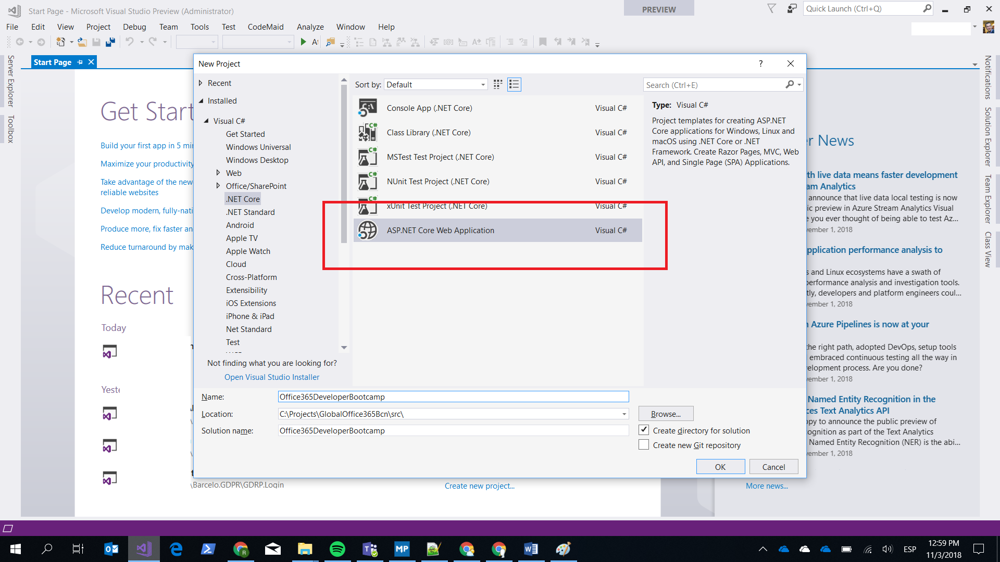
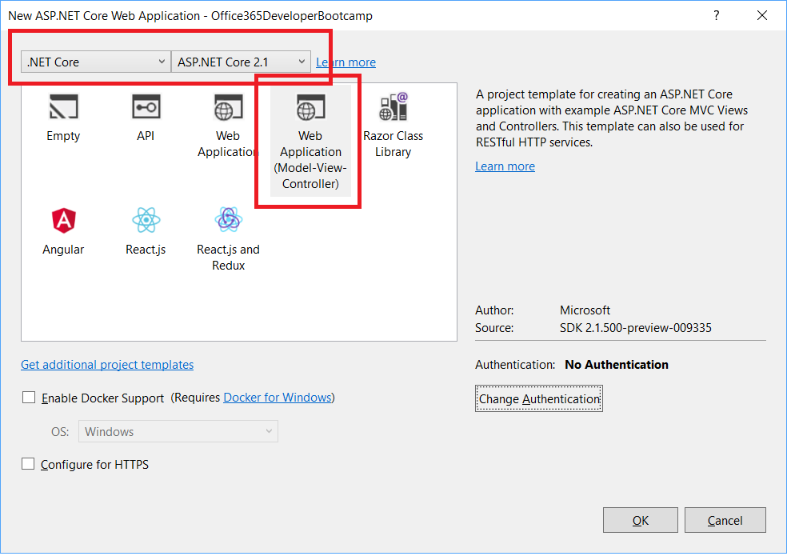
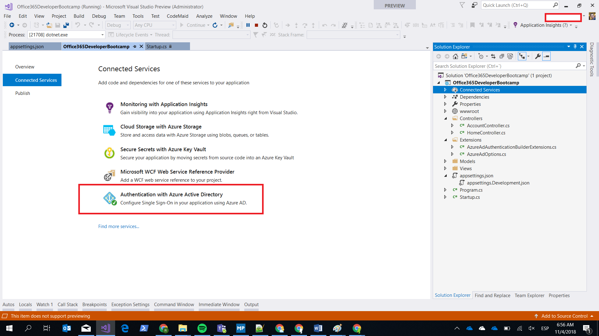
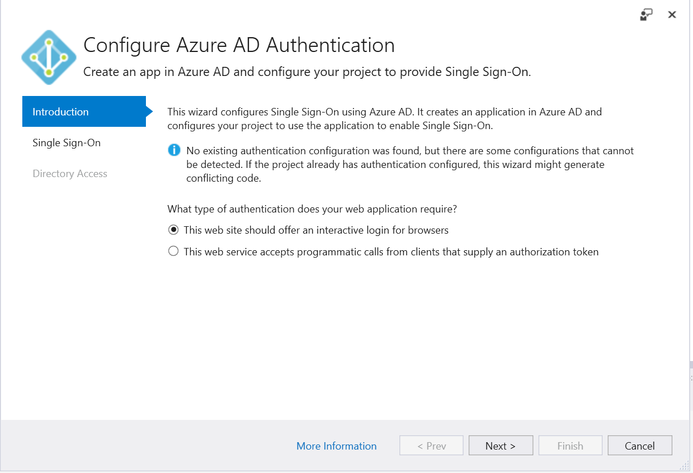
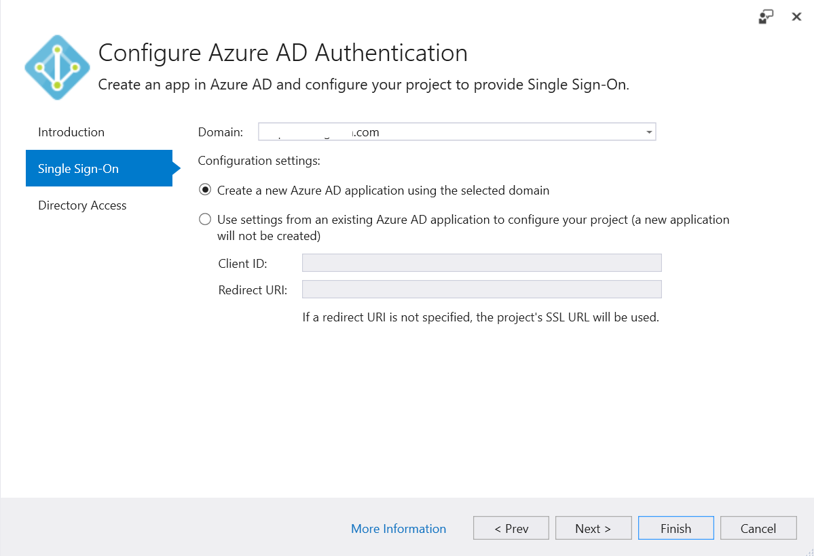
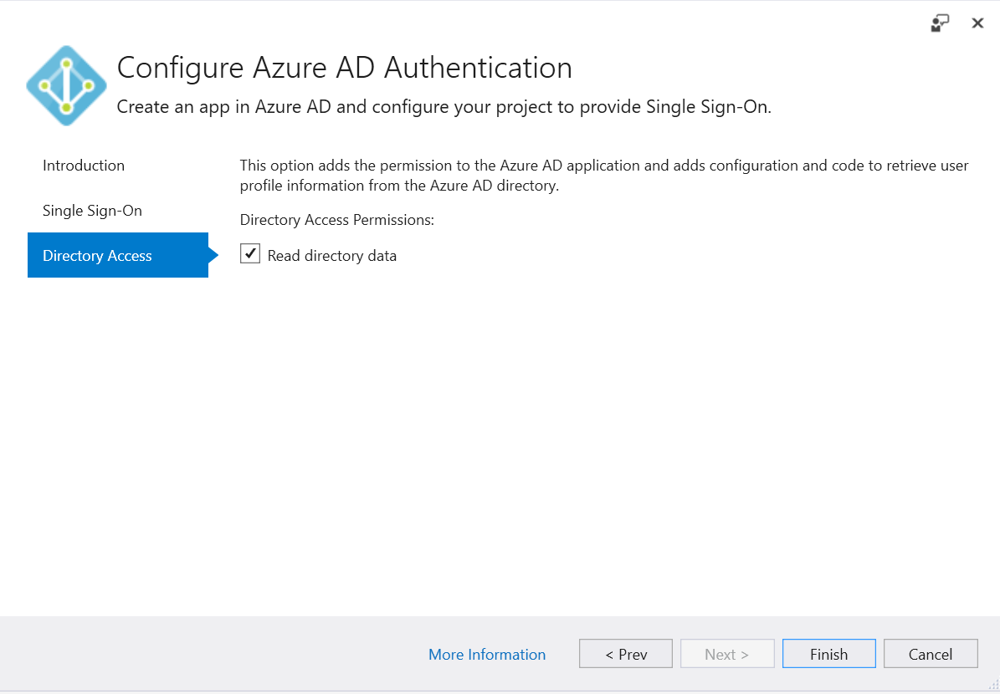
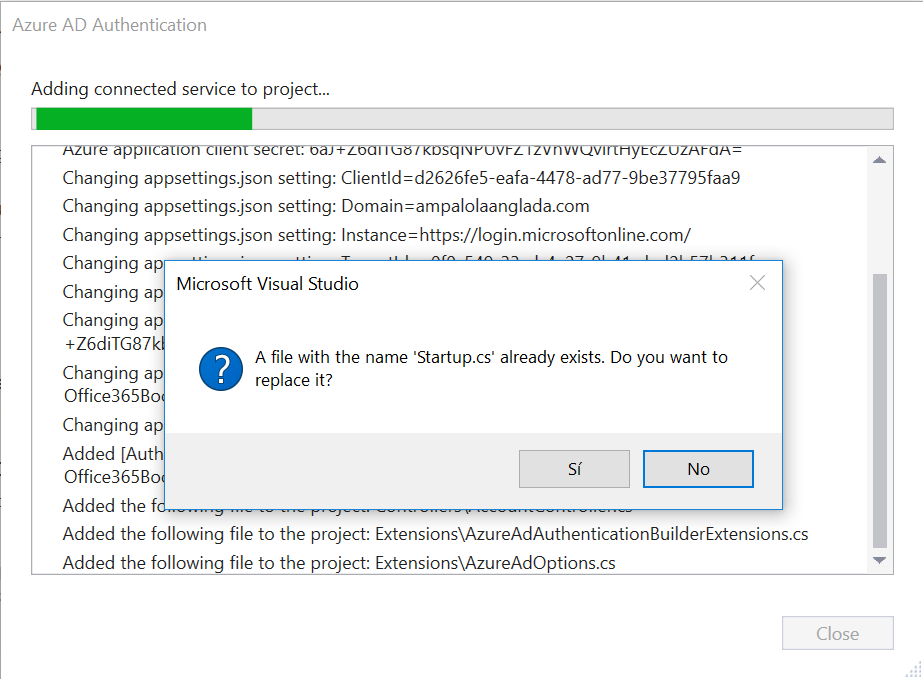
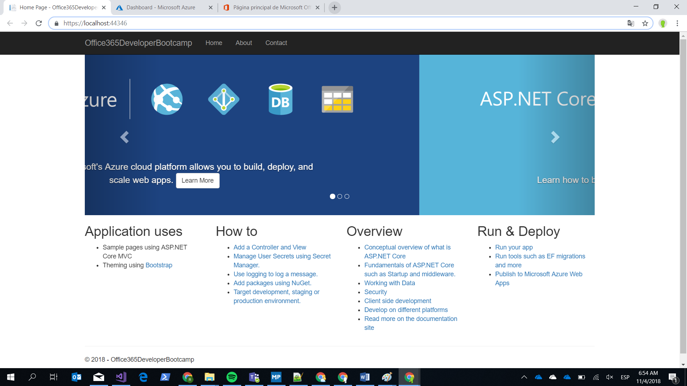

# Azure AD SSO

----------
1 - Crear una aplicación ASP.NET Core MVC en VS2017

          

2 - Una vez creada, nos aparecerá una pantalla por defecto:

- Seleccionar Connected Services
- Seleccionar Authentication with Azure Active Directory 
  

3 - Informar los campos y seguir las indicaciones. **Importante**: El usuario con el que hayáis  hecho el login en Visual Studio debe ser un usuario de vuestro AAD que pueda añadir aplicaciones.

4 - Una vez finalizado abrir el fichero Startup.cs, os debe aparecer lo siguiente:

	public void ConfigureServices(IServiceCollection services)
	{	
		services.AddAuthentication(sharedOptions =>  
		{  
		sharedOptions.DefaultScheme = CookieAuthenticationDefaults.AuthenticationScheme;  
		sharedOptions.DefaultChallengeScheme = OpenIdConnectDefaults.AuthenticationScheme;  
		})  
		.AddAzureAd(options => Configuration.Bind("AzureAd", options))  
		.AddCookie();  
		services.AddMvc();  
	}

5 - Ir al fichero appsettings.json y vemos los datos que nos ha añadido el proceso con la información necesaria:

	"AzureAd": {
	    "ClientId": "yourclientid",
	    "Domain": "yourdomain",
	    "Instance": "https://login.microsoftonline.com/",
	    "TenantId": "yourtenantid",
	    "CallbackPath": "/signin-oidc",
	    "ClientSecret": "yourclientsecretid",
	    "AppIDURL": "yourappidurl",
	    "ConfigView": "API"
	}

6 - Compilar el proyecto y ejecutamos la web.  Si da un error de compilación debido a "app.UseBrowserLink();", comenta esa linea.

7 - Nos logamos con nuestro usuario de office365

8 - Para verificar el SSO:

- Sin cerrar la pestaña, abrimos una nueva y entramos en el portal de office 365: **[portal.office.com](http://portal.office.com "portal office 365")**
  
- Veremos que no nos pide credenciales.

9 - Sin cerrar pestañas, abrimos una nueva y entramos en el portal de Azure: **[portal.azure.com](https://portal.azure.com "portal azure")**. Veremos que entramos sin tener que hacer login.

**¡YA TENEMOS SSO!**

Ir al siguiente ejecicio: [2-Creación infraestructura Azure](../2_Creación_infraestructura_Azure/readme.md)

