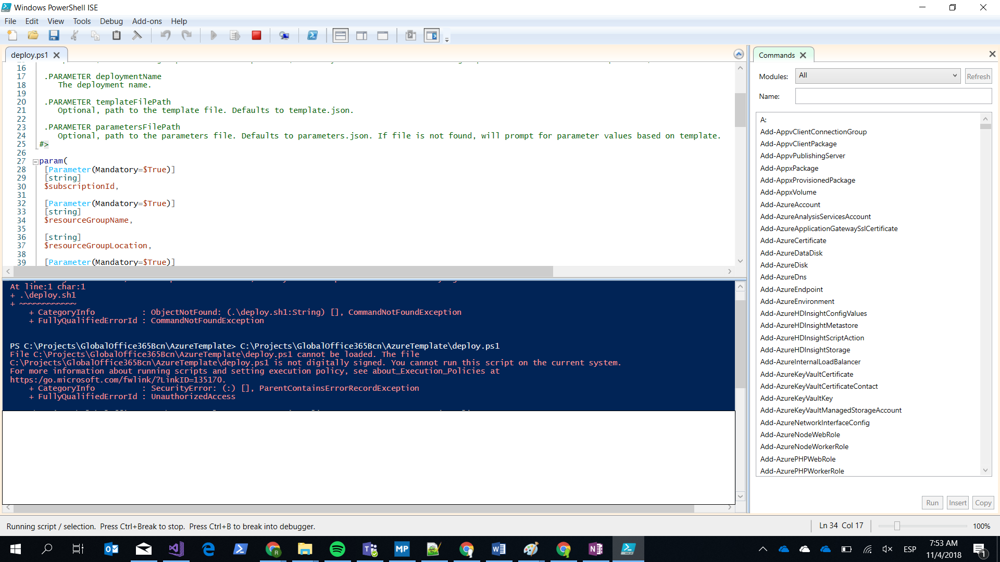
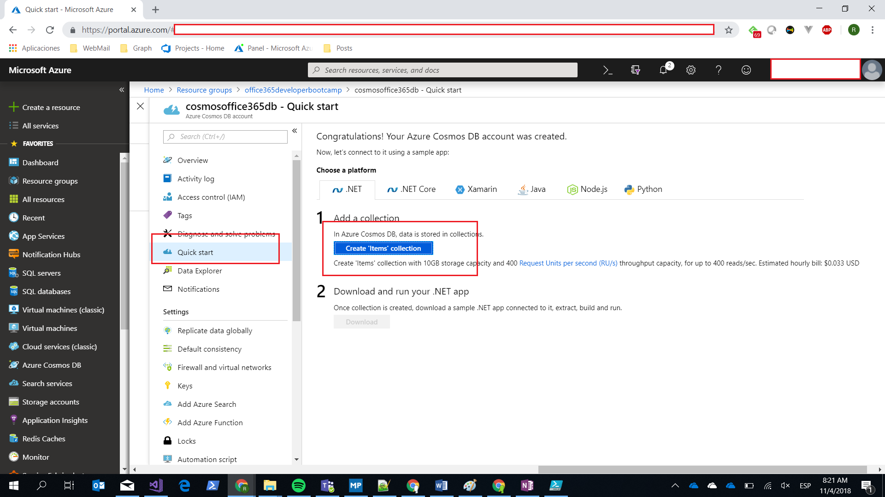

# Creación Infraestructura

----------

> [Template Resource Manager](../../AzureTemplate/)  

1 - Open parameters.json y poner los nombres a los servicios.

2 - Ejecutar el powershell deploy.ps1

> Si os dá el siguiente error:

> 

> Ejecutar el siguiente comando:

> 	Set-ExecutionPolicy -Scope Process -ExecutionPolicy Bypass

3 - Seguir las intrucciones. En region poner West Europe

4 - Una vez creado iremos al portal y crearemos una collection en CosmosDB

