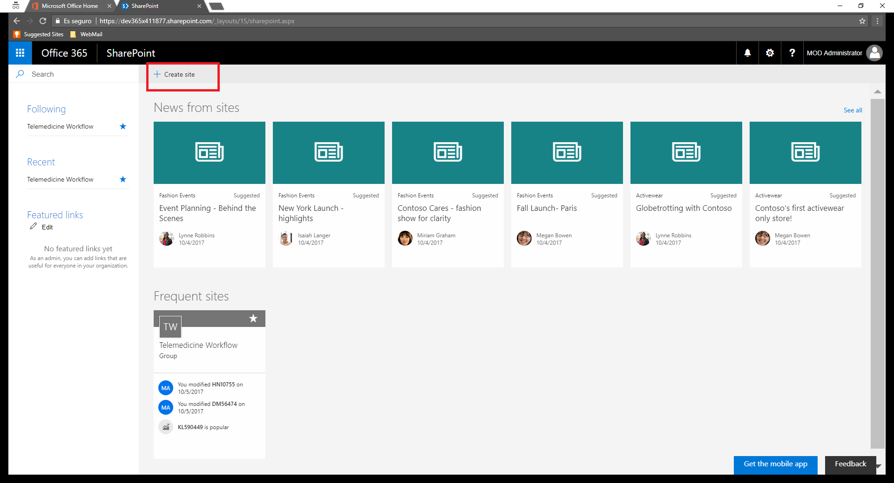
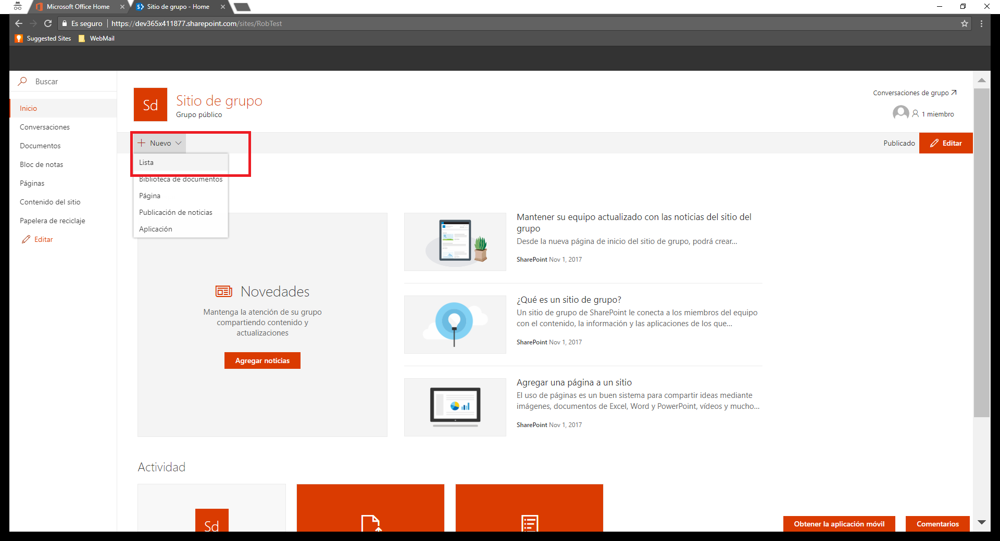
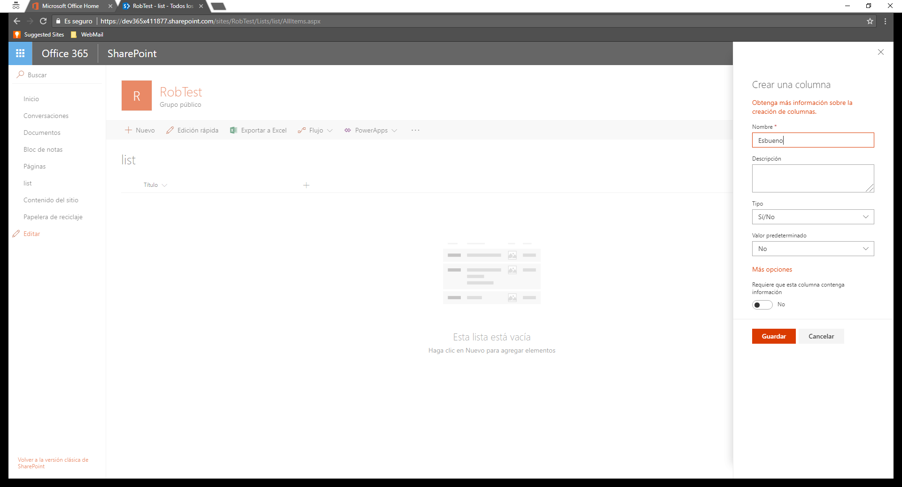

# Creación Entorno Sharepoint

----------

1 - Entramos en el portal de office: [https://portal.office.com](https://portal.office.com "Portal office")
    
2 - Click en la app de SharePoint. Se abrirá SharePoint Online.

3 - Creamos un site de tipo Team Site  

        
4 - Creamos una lista  

         

5 - Añadimos una columna de tipo Sí/No  

         

Ir al siguiente ejecicio: [4-Creación Lógic App](../4_Creación_Logic_App/readme.md)
