# Creación LogicApp

----------

1 - Entramos en el portal de Azure ([https://portal.azure.com](https://portal.azure.com "Portal Azure")) y vamos a la LogicApp que hemos creado en el punto 2

2 - Creamos una LogicApp a partir de una Blank Template.

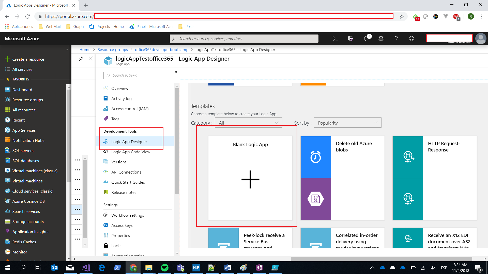    

3 - Buscamos Sharepoint y seleccionamos el Trigger: When an item is created  
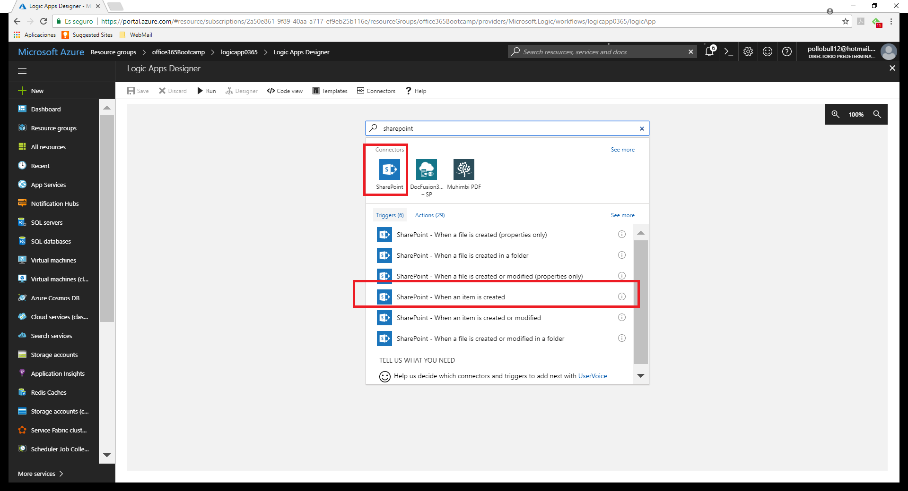         

4 - Nos pide los datos de conexión a Sharepoint:        

- Tenemos que poner la dirección del site que hemos creado
- Debemos seleccionar la lista que hemos creado.
- Poner a 5 segundos el intervalo de check

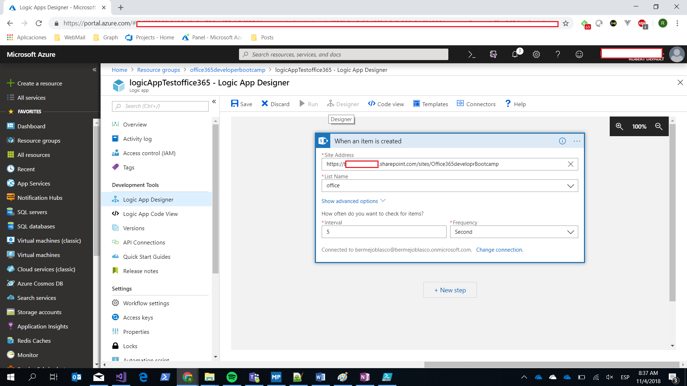
               

5 - Next Step - Choose an action. Buscar TextAnalytics y seleccionar.

- Seleccionar DetectSentiment Action

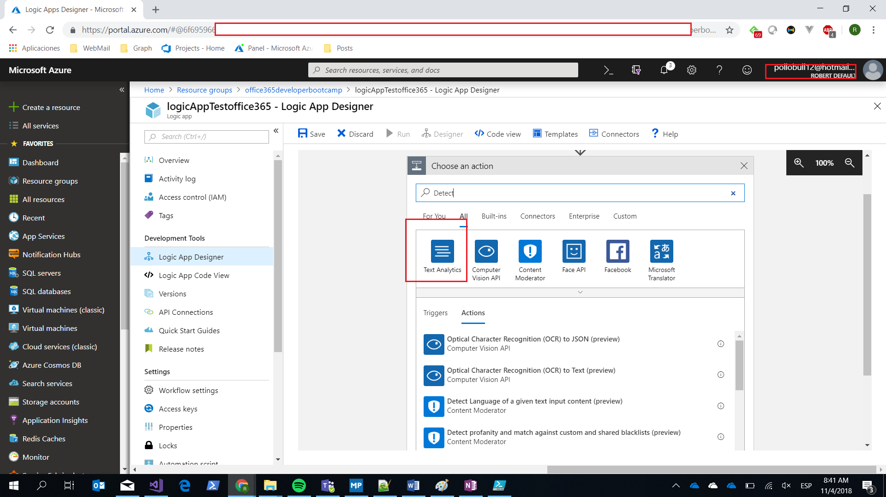

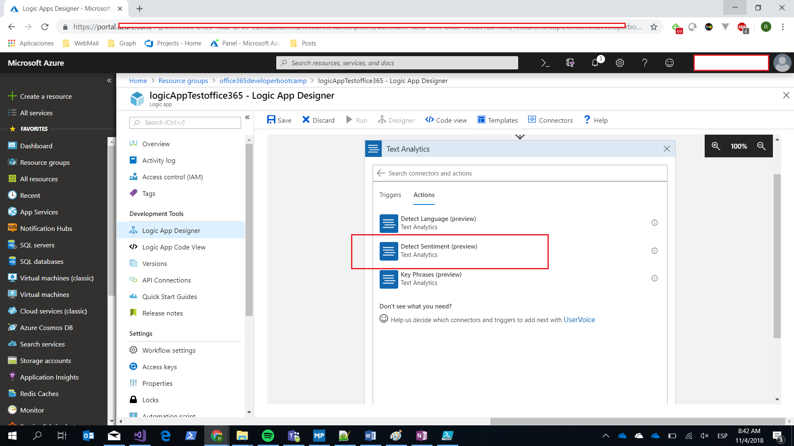

- Ir al portal de Azure al servico de TextAnalytics creado en el punto 2 para obtener los datos de conexión. 

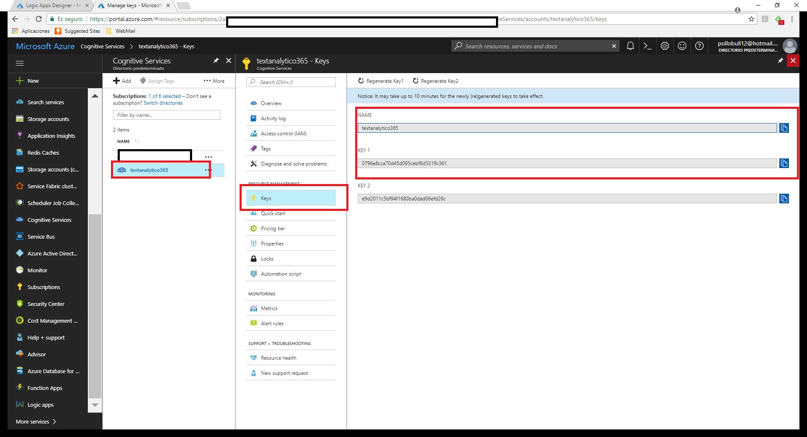               

> A parte os hará falta el endpoint que se encuentra en overview
> 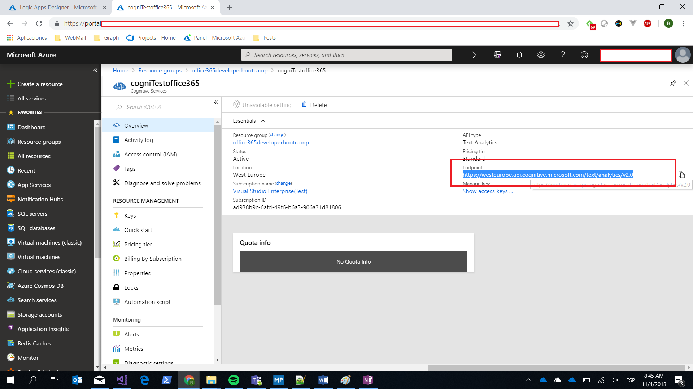    

6 - Cuando entréis en el textbox Text os aparecerán todas las propiedades de la lista de sharepoint seleccionar: Title o Titulo

7- Next Step - Choose an action: Buscar Azure CosmosDB y seleccionar Create or Update Document

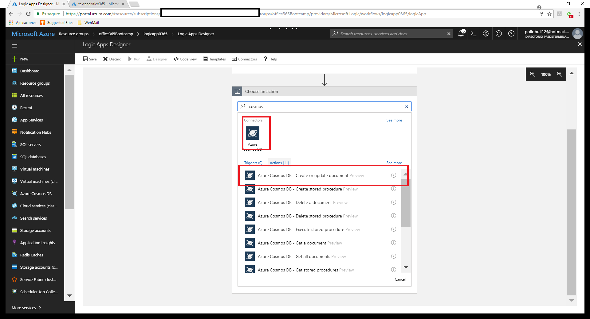        

- Ir al portal de Azure, ir al servicio de CosmosDB creado, ir a key y seleccionar la connectionString y añadirla en la logic app. 

- De los campos que salen solo rellenaremos los campos: Datase ID, Collection ID y Document
Databse ID y Collection ID seleccionaremos la opción del combo, en Document pondremos el JSON a Guardar.

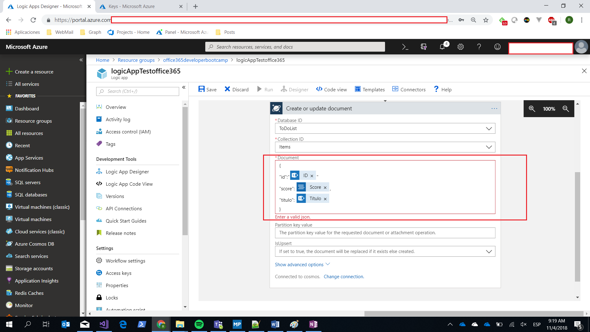               

8 - Next Step - Add a condition:           

- Seleccionamos el Score que nos ha devuelto el Cognitive Servies y actualizaremos el campo SI/NO de la lista de Sharepoint viendo si el campo es mayor o igual a 0.5 (será si) o menos a 0.5 que será No
             

- Ahora en Yes añadimos la acción de Update Document de Sharepoint. Seleccionamos Sharepoint y Update Item.

- Rellenlamos los datos de conexión y en el campo EsBueno ponemos Si, en Id y title seleccionamos los valores que nos vienen del inicio de Sharepoint

- Hacer lo mismo con el No pero poniendo en el campo EsBueno No

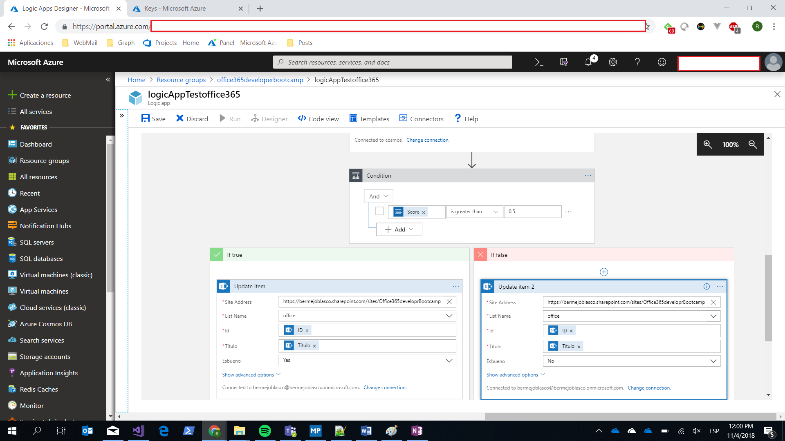

9 - Ya tenemos nuestra LogicApp, le damos a Save and Run arriba de todo.

10 - Ahora vamos a la lista de sharepoint y añadimos un elemento con el campo EsBueno a lo contrario del que debería ser.  
	

> Por ejemplo:  
Title: Esto es algo bueno  
EsBueno: No

### Comprobación resultado

----------
             

11 - Una vez añadido, en el apartado overview de la LogicApp en Azure, le damos a Refresh y nos tiene que aparecer el resultado de la ejecución de la logic app.

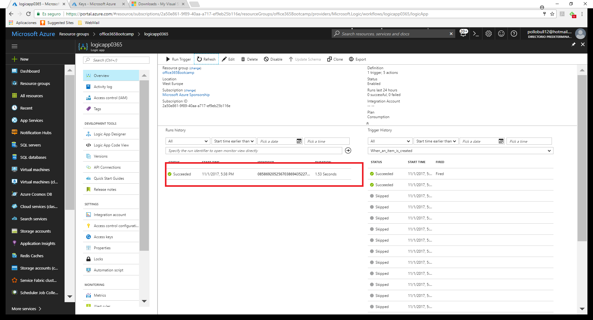         

12 - Ir a la lista de sharepoint, refrescar y ver que ha cambiado el campo EsBueno.

13 - Ir al servicio de CosmosDB, entrar en la collection y ver que se ha añadido el item en CosmosDB DcoumentDB.

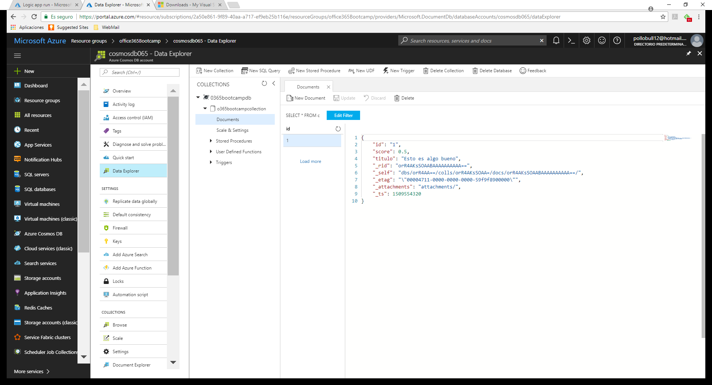         

