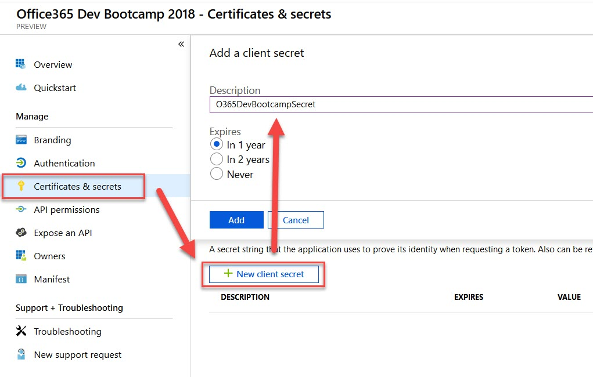
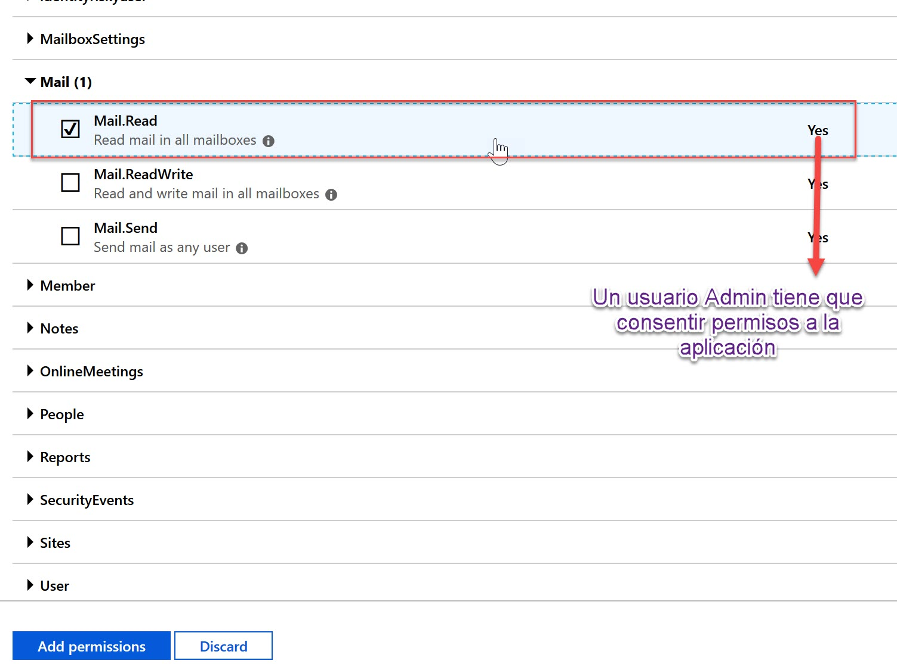
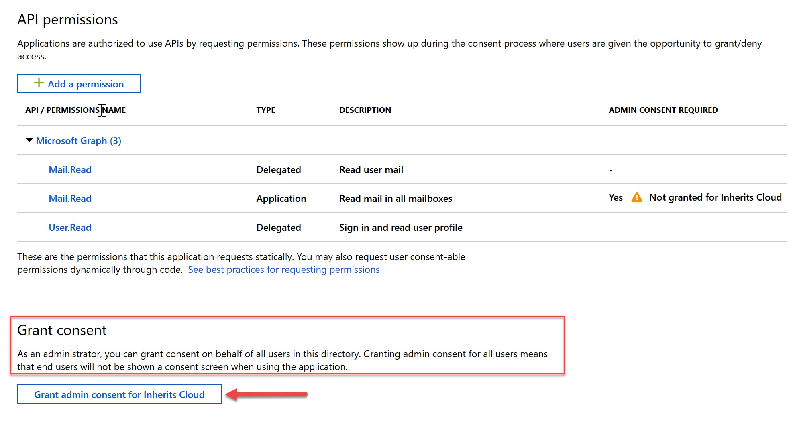

# Global Office 365 Developer Bootcamp Barcelona 2018

## Graph de principio a fin

Laboratorio impartido durante el __Global Office 365 Developer Bootcamp Barcelona 2018__ donde vimos como utilizar la Microsoft Graph API en diferentes escenarios.

### Ponentes
1. Ruben Ramos - [@rubenr79](https://twitter.com/rubenr79)
2. Luis Máñez - MS Office Development MVP [@LuisManez](https://twitter.com/luismanez)

### Pre-requisitos

1. [Office 365 Tenant](https://docs.microsoft.com/en-us/office/developer-program/office-365-developer-program): Puedes obtener una Tenant de Office 365 con el programa para desarrolladores
2. [Azure Active Directory](https://docs.microsoft.com/en-us/office365/securitycompliance/use-your-free-azure-ad-subscription-in-office-365): Puedes usar el Azure AD que tienes en la Tenant de Office 365

### Qué es Graph API?

Microsoft Graph API es la pasarela a todos nuestros datos en la nube de Microsoft. Nos va a permitir poder acceder a estos datos desde cualquier plataforma: web, dispositivo movil, bots, procesos en background, etc.


En la siguiente imagen podemos ver los endpoints principales disponibles en Graph. Como podemos observar, podemos acceder a datos de nuestros usuarios en Azure AD, ficheros en SharePoint, Eventos, Email, Contactos en Outlook, Teams, Planner, etc.


### Authentication basada en Azure Active Directory

Para poder utilizar la Graph API, primero debemos obtener un Token a través de Azure Active Directory. Antes de negociar dicho token, debemos registrar la Aplicación en Azure AD. Para ello navegaremos al portal de Azure en [portal.azure.com](https://portal.azure.com) y entramos en la sección de __Azure Active Directory -> App registrations (preview)__


__Nota__: Desde hace algunas semanas, Microsoft ha liberado una nueva experiencia de registro de Apps. En esta nueva experiencia, las Apps quedan registradas para utilizar la versión V2 Endpoint de Azure AD. Podéis ver las diferencias entre la V1 y V2 en el siguiente enlace [https://docs.microsoft.com/en-us/azure/active-directory/develop/azure-ad-endpoint-comparison](https://docs.microsoft.com/en-us/azure/active-directory/develop/azure-ad-endpoint-comparison)

En la siguiente imagen podéis ver un resumen de las diferencias:


Si hacemos click en _New registration_, nos aparecerá el formulario de inicio de registro, donde introduciremos el nombre de la App y qué tipo de cuentas queremos soportar:
1. Cuentas de organización de la misma Tenant
2. Cualquier cuenta de organización de cualquier Directorio (lo que sería una app multi-tenant)
3. Cualquier cuenta de organización de cualquier Directorio, y cuentas personales Microsoft (Outlook, Hotmail, etc)

Dejamos las URIs de redirección vacías.

La siguiente imagen muestra los datos introducidos para seguir el laboratorio:


1. Nombre: Office365 Dev Bootcamp 2018
2. Cuentas en la Organización

Finalmente, pinchamos en __"Register"__, y ya tendremos registrada nuestra App. Sin embargo, debemos configurar algunas cosas más antes de poder invocar a Graph.

Primero, debemos copiar y guardar el _Application (client) ID_


Ahora, debemos configurar una Key (secret)



Debemos copiar el _secret_ generado (este es el único momento en que estará visible en el portal, así que guardalo bien, o tendrás que re-crear otro).


Ahora, debemos configurar la redirect URI. Para ello marcamos la opción que aparece en la siguente imagen:


En este punto, asegúrate que tienes la siguiente información:
1. __ClientID__
2. __Secret__

El siguiente paso será configurar los permisos de la App, para que pueda invocar a la Graph API. Para ello, navegaremos a la sección __API Permissions__

Por defecto se configura la App para que el usuario poder hacer sign-in y leer su perfil de usuario.


Para añadir más permisos, pulsamos sobre _Add a permission_. Nos abrirá otra _blade_ con las diferentes APIs expuestas por Microsoft, entre ellas, y destacada, la __Microsoft Graph__, así que pulsamos en ella. El siguiente paso es especificar si queremos permisos Delegados __Delegated permissions__, o de Aplicación __Application permissions__. Los primeros son permisos basados en el contexto del usuario logado (previamente habrá algún tipo de Sign In por el usuario). El segundo, son permisos de App, normalmente para escenarios donde no hay un Sign In de usuario, por ejemplo procesos en Background (Azure functions, etc).

Seleccionamos __Delegated permissions__ y nos apareceerán todos los posibles permisos que podemos asignar. Hacemos scroll hasta la sección de __Mail__, y seleccionamos permisos de __Mail.Read__ lo que permitirá a nuestra App, leer nuestros Emails:


En este punto, tenemos la App completamente registrada y configurada, así que es momento de saltar a Visual Studio, y ver cómo podemos obtener un Token para invocar a Graph API.

### Obtener Token para Graph desde una Applicación de consola (Delegated permissions)

En esta sección vamos a abrir visual studio para crear un proyecto de aplicación de consola, donde obtendremos un Token para Graph utilizando los permisos delegados de la Azure AD App que hemos registrado en el punto anterior.

1. Abre Visual Studio y crea un proyecto _Windows Desktop -> Console App (.Net Framework)_
2. Añade el paquete de NuGet __Microsoft.Identity.Client__ (el paquete es todavía una pre-release, así que asegurate de marcar la opción _Include prerelease_ en Nuget)
3. Crea una nueva clase __static__ _TokenProvider_
4. Añade las siguientes constantes, con los valores de registro de la App en Azure AD

```csharp
private const string GraphResourceUri = "https://graph.microsoft.com";
private const string Tenant = "YOUR_TENANT_ID";
private const string ClientId = "YOUR_CLIENT_ID";
private const string Secret = "YOUR_SECRET";
private const string Authority = "https://login.microsoftonline.com/{0}";
private const string RedirectUri = "urn:ietf:wg:oauth:2.0:oob";
```
El TenantID es el identificador de tu Azure AD Tenant, que también puedes encontrar en el registro de la App en Azure AD (Sección _Overview_)

5. Crea un método _GetToken_ con el siguiente código
```csharp
        /// <summary>
        /// Uses MSAL (v2 endpoint) to return a Token using Web Login form (delegated permissions)
        /// </summary>
        /// <returns></returns>
        public static async Task<string> GetToken(string[] scopes)
        {
            AuthenticationResult authResult;

            var authority = string.Format(Authority, Tenant);

            var publicClientApp = new PublicClientApplication(ClientId, authority);

            var accounts = await publicClientApp.GetAccountsAsync();

            try
            {
                authResult = await publicClientApp.AcquireTokenSilentAsync(scopes, accounts.FirstOrDefault());

                return authResult.AccessToken;
            }
            catch (MsalUiRequiredException ex)
            {
                try
                {
                    authResult = await publicClientApp.AcquireTokenAsync(scopes);

                    return authResult.AccessToken;
                }
                catch (MsalException msalex)
                {
                    System.Diagnostics.Debug.WriteLine($"MsalException: {msalex.Message}");
                }
            }

            return null;
        }
```

El método utiliza la librería MSAL, para negociar y obtener un Token con el contexto del usuario. El usuario tendrá que hacer Sign-In en la página de Login de Azure AD.

6. Añade un método _PrintToken_ en al Main de _Program.cs_ con el siguiente código:
```csharp
    class Program
    {
        static void Main(string[] args)
        {
            try
            {
                PrintToken().GetAwaiter().GetResult();
            }
            catch (Exception ex)
            {
                Console.WriteLine(ex.ToString());
            }

            Console.WriteLine("Any key to finish");
            Console.ReadLine();
        }

        public static async Task PrintToken()
        {
            var scopes = new[] { "mail.read" };

            var token = await TokenProvider.GetToken(scopes);

            Console.WriteLine(token);
        }
    }
```

Si ejecutamos ahora la aplicación de consola, veremos como primero nos pide que hagamos Sign In con la típica pantalla de Login de Azure AD. Además, nos pedirá que demos consentimiento para poder acceder a nuestros emails:


Una vez consentimos, veremos como un Token se imprime en pantalla. Con dicho token ya podemos acceder a Graph API y recuperar nuestro emails. Por ejemplo, podemos usar Postman para hacer una petición al endpoint de Graph:

__https://graph.microsoft.com/v1.0/me/messages?$select=subject,importance__

Y obtener el Asunto de nuestros emails:


### Obtener Token con Application Permissions

En el lab anterior hemos visto como podemos obtener un Token con login interactivo del usuario. Ahora vamos a ver como obtener el Token con permisos de Aplicación, lo que nos será útil en escenarios de processos en background.

Antes de seguir con código, primero tenemos que modificar los permisos de nuestra App para poder obtener el Token con permisos de Aplicación. Volvamos al portal de Azure, y en nuestra App, en la sección de Permisos, añadimos un nuevo permiso, en este caso __Application permissions__



Como veis en la imagen superior, es necesario que un Administrador consienta los permisos. La manera más sencilla de hacer esto, es utilizar el botón:



Ahora ya tenemos la App configurada con permisos para leer el email de los usuarios. Volvemos a Visual Studio, y añadimos el siguiente método al _TokenController_

```csharp
        /// <summary>
        /// Uses MSAL (v2 endpoint) to return a Token using Application permissions
        /// </summary>
        /// <returns></returns>
        public static async Task<string> GetApplicationToken(string[] scopes)
        {
            var authority = string.Format(Authority, Tenant);

            var clientApplication = new ConfidentialClientApplication(
                ClientId, 
                authority, 
                RedirectUri, 
                new ClientCredential(Secret), null, new TokenCache());

            var authResult = await clientApplication.AcquireTokenForClientAsync(scopes);

            return authResult.AccessToken;
        }
```

Para probar el nuevo método, añadimos otro método al Program.cs:

```csharp
        public static async Task PrintApplicationToken()
        {
            var scopes = new[] { "https://graph.microsoft.com/.default" };

            var token = await TokenProvider.GetApplicationToken(scopes);

            Console.WriteLine(token);
        }
```

__Nota__: fijaros como el Scope para el caso de permisos de Aplicación es directamente la Graph API __"https://graph.microsoft.com/.default"__. De esta manera, la App tendrá todos los permisos registrados a nivel de App en Azure AD (en nuestro caso, __"Mail.Read"__)

Si llamamos a este nuevo método desde el Main, obtendremos un Token de Aplicación (ningún formulario de Sign In aparece)

Queda como ejercicio fuera del Bootcamp probar dicho Token desde Postman, para obtener los emails de un usuario concreto. Para ello, previamente deberás conocer el ID de algún usuario, para llamar al Endpoint de Graph: __https://graph.microsoft.com/v1.0/users/{user_guid}/messages__

Recomendamos utilizar la herramienta Graph Explorer para poder ejecutar queries sobre Graph, ya que permite logarte con tu usuario, configurar permisos, y lanzar queries sobre Graph de forma fácil: [Graph Explorer](https://developer.microsoft.com/en-us/graph/graph-explorer)